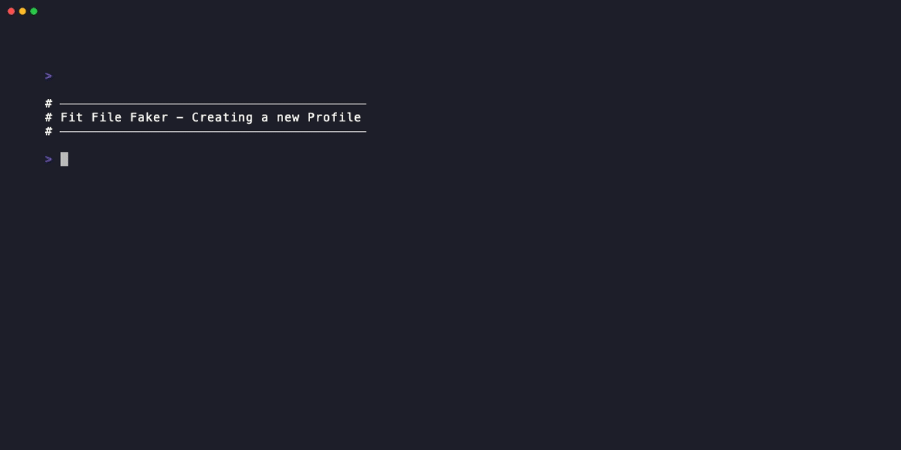
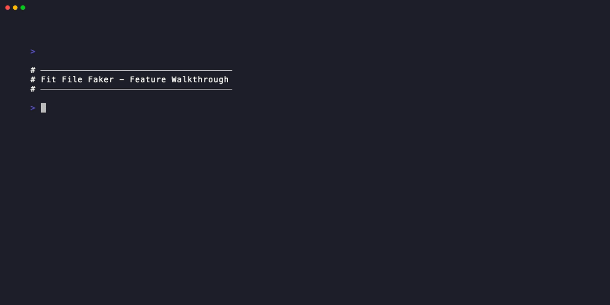
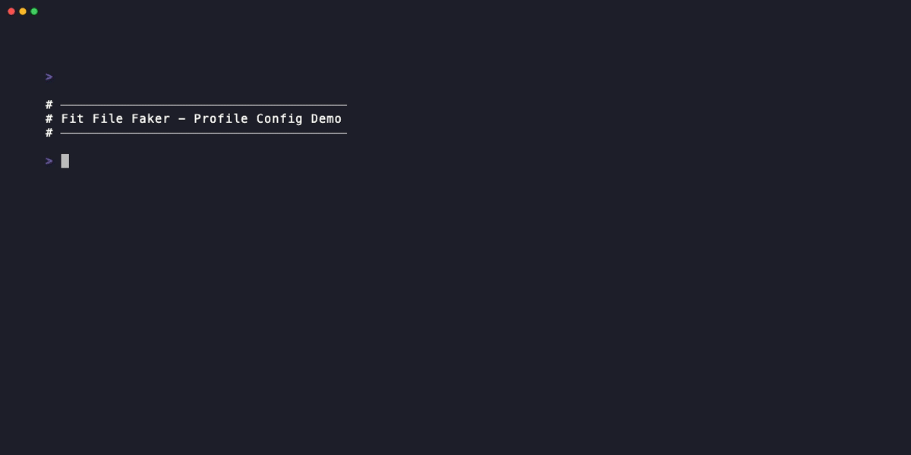

# FIT File Faker

<div align="center" markdown="1">


[](https://pypi.org/project/fit-file-faker/)
[](https://github.com/jat255/Fit-File-Faker/blob/main/LICENSE.md)
[](https://github.com/jat255/Fit-File-Faker/actions/workflows/test.yml)
[](https://codecov.io/gh/jat255/fit-file-faker)
[](https://ko-fi.com/josh851356)

</div>

This application allows you to easily modify [FIT](https://developer.garmin.com/fit/overview/) files to make them appear to come from a Garmin device (Edge 830 by default, or any supported Garmin cycling device) and upload them to Garmin Connect using the [`garth`](https://github.com/matin/garth/) library. The FIT editing is done using Stages Cycling's [`fit_tool`](https://bitbucket.org/stagescycling/python_fit_tool/src/main/) library.

!!! support "Support This Project"
    If FIT File Faker saves you time or enhances your training workflow, consider [buying me a coffee ☕](https://ko-fi.com/josh851356). Your support helps maintain and improve this project!

Additionally, it can be run in a "monitor" mode that will watch a folder for new FIT files and will automatically edit/upload them as they are produced. One potential application of this mode is to have the tool auto-start on the computer that you use for indoor training, so rides are automatically uploaded to Garmin Connect when you finish.

## Overview

The primary motivation for this tool came from the fact that that [TrainingPeaks Virtual](https://www.trainingpeaks.com/virtual/) (previously *indieVelo*) does/did not support automatic uploading to [Garmin Connect](http://connect.garmin.com/). The files can be manually uploaded after the fact, but since they are not "from Garmin", they will not be used to calculate Garmin's **Training Effect**, which is used for suggested workouts and other features, especially if you have a watch or cycling computer that uses these features.

By changing the FIT file to appear to come from a Garmin device, those features are enabled.

!!! success "Use Cases"
    Other users have reported using this tool to edit FIT files produced by:

    - **[Zwift](https://www.zwift.com/)**: Upload to Garmin Connect so activities count towards badges and challenges
    - **[TrainingPeaks Virtual](https://www.trainingpeaks.com/virtual/)**: Enable Garmin's Training Effect calculations
    - **[MyWhoosh](https://mywhoosh.com/)**: Similar compatibility benefits
    - **[Hammerhead Karoo](https://www.hammerhead.io/)**: Enhanced Garmin Connect integration
    - **[COROS Dura](https://coros.com/dura)**: Enhanced Garmin Connect integration

## Contributors

- [jat255](https://github.com/jat255): Primary author
- [benjmarshall](https://github.com/benjmarshall): bug fixes, monitor mode, and other improvements
- [Kellett](https://github.com/Kellett): support for Zwift FIT files
- [lrybak](https://github.com/lrybak): support for Hammerhead Karoo files
- [dermarzel](https://github.com/dermarzel): support for MyWhoosh files

## Installation

!!! info "Requirements"
    Python 3.12 or higher is required. If your system Python is older, use [pyenv](https://github.com/pyenv/pyenv) or [uv](https://docs.astral.sh/uv/) to manage locally installed versions.

This tool works cross-platform on **Windows**, **macOS**, and **Linux** (primarily developed on Linux).

=== "uv (Recommended)"

    If you have [uv](https://docs.astral.sh/uv/guides/tools/#installing-tools) installed:

    ```bash
    uv tool install fit-file-faker
    ```

    This installs the tool and makes `fit-file-faker` available on your PATH.

=== "pipx"

    If you have [pipx](https://pipx.pypa.io/latest/installation/) installed:

    ```bash
    pipx install fit-file-faker
    ```

    This installs the tool and makes `fit-file-faker` available on your PATH.

=== "pip"

    Install manually using pip in a virtual environment:

    ```bash
    python -m venv .venv
    source .venv/bin/activate  # On Windows: .venv\Scripts\activate
    pip install fit-file-faker
    ```

    The pip package installs a script named `fit-file-faker` that should be available on your path when the virtual environment is activated.

=== "Development"

    For development, clone the repo and use [uv](https://docs.astral.sh/uv/):

    ```bash
    git clone https://github.com/jat255/Fit-File-Faker.git
    cd Fit-File-Faker
    uv sync  # Installs all dependencies
    ```

    **Pre-commit hooks:**

    The project uses [pre-commit](https://pre-commit.com/) to run code quality checks. After cloning and running `uv sync`:

    ```bash
    uv run pre-commit install
    ```

    This automatically runs `ruff check` and `ruff format` on staged files before each commit.

    Run hooks manually on all files:

    ```bash
    uv run pre-commit run --all-files
    ```

## Configuration

As of version 2.0.0, FIT File Faker now supports **multi-profile configuration**, allowing you to manage multiple Garmin accounts and trainer apps. See the [Multi-Profile Guide](profiles.md) for comprehensive documentation.

### Multi-Profile Format

```json
{
  "profiles": [
    {
      "name": "tpv",
      "app_type": "tp_virtual",
      "garmin_username": "user@work.com",
      "garmin_password": "secret123",
      "fitfiles_path": "/Users/josh/TPVirtual/abc123/FITFiles"
    },
    {
      "name": "zwift",
      "app_type": "zwift",
      "garmin_username": "personal@gmail.com",
      "garmin_password": "secret456",
      "fitfiles_path": "/Users/josh/Documents/Zwift/Activities"
    }
  ],
  "default_profile": "tpv"
}
```

!!! tip "Profile Management"
    Use the interactive profile manager to create and manage profiles:

    ```bash
    fit-file-faker --config-menu
    ```

    <div align="center">
      
      <p><em>Creating a new profile with the interactive menu</em></p>
    </div>

    This supports:

    - **Multiple Garmin accounts** with isolated credentials
    - **Multiple trainer apps** (TPV, Zwift, MyWhoosh)
    - **Auto-detection** of FIT file directories
    - **Customizable device simulation** (Edge 830, Edge 1030, Tacx, etc.)
    - **Profile-specific monitoring** and uploads


### Single Profile (Legacy Format)

For backward compatibility, the tool still supports the legacy single-profile format:

```json
{
  "garmin_username": "username",
  "garmin_password": "password",
  "fitfiles_path": "C:\\Users\\username\\Documents\\TPVirtual\\0123456789ABCDEF\\FITFiles"
}
```

!!! warning "Automatic Migration"
    When you first run v2.0.0+, legacy configs are automatically migrated to the multi-profile format with a "default" profile.

## Device Simulation

By default, FIT File Faker modifies files to appear as if they came from a **Garmin Edge 830**. However, each profile can be configured to simulate a different Garmin device.

### Supported Devices

The tool supports simulation of any Garmin cycling/training device, including:

- **Edge Series**: Edge 130, Edge 520, Edge 530, Edge 830, Edge 1030, Edge 1040, etc.
- **Tacx Trainers**: Tacx NEO series and other Tacx smart trainers
- **Training Devices**: Various other Garmin training computers

!!! info "Device Selection"
    During profile creation or editing, you can optionally customize which Garmin device to simulate. The tool presents a filtered list of ~66 supported Garmin cycling and training devices.

### Customizing Device Simulation

When creating or editing a profile via `--config-menu`, you'll be prompted:

```
? Customize device simulation? (default: Garmin Edge 830) (y/N)
```

If you select **Yes**, you can:

1. **Choose from a list** of supported Garmin devices (Edge, Tacx, Training series)
2. **Enter a custom numeric device ID** for newer devices not yet in the list

!!! tip "Custom Device IDs"
    If you enter a numeric device ID that's not recognized, the tool will show a warning but still create/update the profile. This allows using newer Garmin devices that may not be in the library yet.

### Example: Different Devices for Different Profiles

```json
{
  "profiles": [
    {
      "name": "tpv",
      "app_type": "tp_virtual",
      "garmin_username": "user@example.com",
      "garmin_password": "secret",
      "fitfiles_path": "/path/to/tpv",
      "manufacturer": 1,
      "device": 3122  // Edge 830 (default)
    },
    {
      "name": "zwift",
      "app_type": "zwift",
      "garmin_username": "user@example.com",
      "garmin_password": "secret",
      "fitfiles_path": "/path/to/zwift",
      "manufacturer": 1,
      "device": 2713  // Edge 1030
    }
  ]
}
```

### Why Customize Device Simulation?

- **Match your actual device**: If you own an Edge 1030, simulate that device for consistency
- **Testing**: Try different devices to see how Garmin Connect responds
- **Feature compatibility**: Some Garmin devices may enable different features in Garmin Connect

!!! note "Backward Compatibility"
    Existing profiles without device settings automatically default to Edge 830, maintaining the original behavior.

## Usage

<div align="center">
  
  <p><em>Overview of FIT File Faker features and commands</em></p>
</div>

### Command-line Options

To see all available options:

```bash
fit-file-faker -h
```

```
usage: fit-file-faker [-h] [--profile PROFILE] [--list-profiles] [--config-menu] [--show-dirs] [-u] [-ua] [-p] [-m] [-d] [-v] [input_path]

Tool to add Garmin device information to FIT files and upload them to Garmin Connect. Currently, only FIT files produced by TrainingPeaks Virtual (https://www.trainingpeaks.com/virtual/) and Zwift
(https://www.zwift.com/) are supported, but it's possible others may work.

positional arguments:
  input_path           the FIT file or directory to process. This argument can be omitted if the 'fitfiles_path' config value is set (that directory will be used instead). By default, files will just be
                       edited. Specify the "-u" flag to also upload them to Garmin Connect.

options:
  -h, --help           show this help message and exit
  --profile PROFILE    specify which profile to use (if not specified, uses default profile)
  --list-profiles      list all available profiles and exit
  --config-menu        launch the interactive profile management menu
  --show-dirs          show the directories used by Fit File Faker for configuration and cache
  -u, --upload         upload FIT file (after editing) to Garmin Connect
  -ua, --upload-all    upload all FIT files in directory (if they are not in "already processed" list)
  -p, --preinitialize  preinitialize the list of processed FIT files (mark all existing files in directory as already uploaded)
  -m, --monitor        monitor a directory and upload all newly created FIT files as they are found
  -d, --dryrun         perform a dry run, meaning any files processed will not be saved nor uploaded
  -v, --verbose        increase verbosity of log output
```

### Basic Usage

The default behavior loads a given FIT file and outputs a file named `path_to_file_modified.fit` that has been edited and can be manually imported to Garmin Connect:

```bash
fit-file-faker path_to_file.fit
```

If a directory is supplied rather than a single file, all FIT files in that directory will be processed in the same way.

### Upload to Garmin Connect

### Multi-Profile Usage

FIT File Faker v2.0.0+ supports multiple profiles for different Garmin accounts and trainer apps.

#### Profile Selection

```bash
# Use a specific profile
fit-file-faker --profile zwift -ua
fit-file-faker -p tpv -u ride.fit

# List all profiles
fit-file-faker --list-profiles

# Launch interactive profile manager
fit-file-faker --config-menu

# Show directories used by FIT File Faker
fit-file-faker --show-dirs
```

<div align="center">
  
  <p><em>Editing an existing profile configuration</em></p>
</div>

#### Profile Selection Priority

1. Explicit `--profile` argument
2. Default profile (marked with ⭐)
3. Interactive prompt (if multiple profiles exist)
4. Error if no profiles configured

#### Credential Isolation

Each profile has isolated Garmin credentials stored in profile-specific directories:
- `.garth_tpv/` for TPV profile
- `.garth_zwift/` for Zwift profile
- etc.

### Verbose Output

The `-v` flag can be used (with any of the other options) to provide more debugging output:

```bash
fit-file-faker -u path_to_file.fit -v
```

Example output:

```
[12:38:33] INFO     Activity timestamp is "2024-05-21T17:15:48"                              app.py:84
           DEBUG    Record: 1 - manufacturer: 255 ("DEVELOPMENT") - product: 0 - garmin      app.py:55
                    product: None ("BLANK")
           DEBUG        Modifying values                                                     app.py:87
           DEBUG        New Record: 1 - manufacturer: 1 ("GARMIN") - product: 3122 - garmin  app.py:55
                    product: 3122 ("GarminProduct.EDGE_830")
           DEBUG    Record: 14 - manufacturer: 32 ("WAHOO_FITNESS") - product: 40 - garmin   app.py:55
                    product: None ("BLANK")
           DEBUG        Modifying values                                                     app.py:97
           DEBUG        New Record: 14 - manufacturer: 1 ("GARMIN") - product: 3122 - garmin app.py:55
                    product: 3122 ("GarminProduct.EDGE_830")
[12:38:34] DEBUG    Using stored Garmin credentials from ".garth" directory                 app.py:118
[12:38:35] INFO     ✅ Successfully uploaded "path_to_file.fit"                             app.py:137
```

### "Upload All" and "Monitor" Modes

#### Upload All

The `--upload-all` option will search for all FIT files either in the directory given on the command line, or in the one specified in the `fitfiles_path` config option. The script will:

1. Compare the files found to a list of files already seen (stored in that directory's `.uploaded_files.json` file)
2. Edit them
3. Upload each to Garmin Connect

The edited files will be written into a temporary file and discarded when the script finishes running, and the filenames will be stored into a JSON file so they are skipped the next time the script is run.

#### Monitor Mode

The `--monitor` option automates the upload all function by watching the filesystem in the specified directory for any new FIT files. It will continue running until the user interrupts the process by pressing `ctrl-c`.

Example output when a new file named `new_fit_file.fit` is detected:

```bash
$ fit-file-faker --monitor /home/user/Documents/TPVirtual/0123456789ABCEDF/FITFiles

[14:03:32] INFO     Using path "/home/user/Documents/TPVirtual/                    app.py:561
                    0123456789ABCEDF/FITFiles" from command line input
           INFO     Monitoring directory: "/home/user/Documents/TPVirtual/         app.py:367
                    0123456789ABCEDF/FITFiles"
[14:03:44] INFO     New file detected - "/home/user/Documents/TPVirtual/           app.py:94
                    0123456789ABCEDF/FITFiles/new_fit_file.fit"; sleeping for
                    5 seconds to ensure TPV finishes writing file
[14:03:50] INFO     Found 1 files to edit/upload                                   app.py:333
           INFO     Processing "new_fit_file.fit"                                  app.py:340
           INFO     Processing "/home/user/Documents/TPVirtual                     app.py:202
                    sync/0123456789ABCEDF/FITFiles/new_fit_file.fit"
[14:03:58] INFO     Activity timestamp is "2025-01-03T17:01:45"                    app.py:223
[14:03:59] INFO     Saving modified data to "/tmp/tmpsn4gvpkh"                     app.py:250
[14:04:00] INFO     Uploading modified file to Garmin Connect                      app.py:346
[14:04:01] INFO     Uploading "/tmp/tmpsn4gvpkh" using garth                       app.py:295
^C[14:04:46] INFO     Received keyboard interrupt, shutting down monitor           app.py:372
```

!!! warning "Pre-initializing Uploaded Files"
    If your TrainingPeaks Virtual user data folder already contains FIT files which you have previously uploaded to Garmin Connect using a different method, you can pre-initialize the list of uploaded files to avoid any possibility of uploading duplicates.

    Use the `--preinitialize` option to process a directory (defaults to the configured TrainingPeaks Virtual user data directory) and add all files to the list of previously uploaded files:

    ```bash
    fit-file-faker --preinitialize
    ```

    After this, any use of the `--upload-all` or `--monitor` options will ignore these pre-existing files.

### Already Uploaded Files

!!! info "Duplicate Detection"
    If a file with the same timestamp already exists on the Garmin Connect account, Garmin will reject the upload. This script will detect that and output:

    ```
    [13:32:48] INFO     Activity timestamp is "2024-05-10T17:17:34"                              app.py:85
               INFO     Saving modified data to "path_to_file_modified.fit"                      app.py:107
    [13:32:49] WARNING  ❌ Received HTTP conflict (activity already exists) for                  app.py:143
                        "path_to_file.fit"
    ```

## Troubleshooting

If you run into problems, please [create an issue](https://github.com/jat255/Fit-File-Faker/issues/new/choose) on the GitHub repo.

!!! tip "Viewing Configuration Directories"
    Use `fit-file-faker --show-dirs` to see:

    - Configuration file location
    - Cache directory location
    - Garmin credential directories for each profile
    - Executable paths

    This can be helpful when troubleshooting configuration or credential issues.

!!! note
    As this is a side-project provided for free (as in speech and beer), support times may vary 😅.

## Next Steps

- Learn about the [development workflow and testing](developer-guide.md)
- Check the [changelog](changelog.md) for recent updates
- View the project on [GitHub](https://github.com/jat255/Fit-File-Faker)
- Install from [PyPI](https://pypi.org/project/fit-file-faker/)

## Disclaimer

The use of any registered or unregistered trademarks owned by third-parties are used only for informational purposes and no endorsement of this software by the owners of such trademarks are implied, explicitly or otherwise. The terms/trademarks Garmin, indieVelo, TrainingPeaks, TrainingPeaks Virtual, Garmin Connect, Stages Cycling, MyWhoosh, Hammerhead Karoo, COROS Dura, Zwift, and any others are used under fair use doctrine solely to facilitate understanding.

Likewise, the software is provided "as is", without warranty of any kind, express or implied, including but not limited to the warranties of merchantability, fitness for a particular purpose and noninfringement. In no event shall the authors or copyright holders be liable for any claim, damages or other liability, whether in an action of contract, tort or otherwise, arising from, out of or in connection with the software or the use or other dealings in the software.

## Logo

The application logo was generated primarily using AI tools. If you would like to contribute a better, custom-designed logo, we would welcome pull requests! Please feel free to open a GitHub issue or submit a PR with logo design suggestions.
